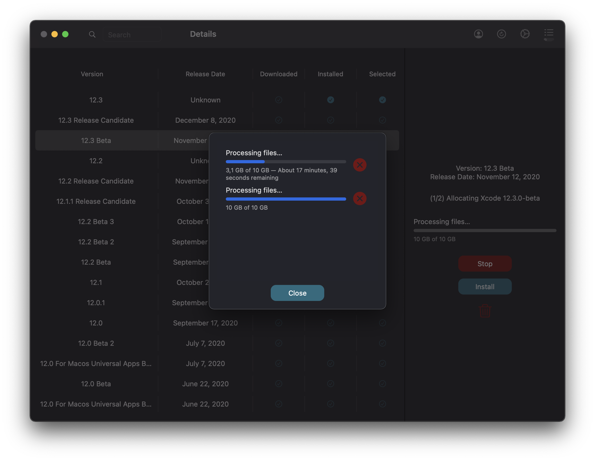

    

# XcodeUpdates
SwiftUI implementation of xcodes by RobotsAndPencils

# Screenshots

    

    

# Technical Details
- Project supports macOS Big Sur (11.+)
- Project is written in SwiftUI
- Project relies on an amazing (xcodes)[https://github.com/RobotsAndPencils/xcodes] command line utility made by (RobotsAndPencils)[https://github.com/RobotsAndPencils] but uses the modified version which is available as open-source (here)[https://github.com/art-divin/xcodes].

# Known Issues
- 2FA when there are 2 or more verified phone numbers is not currently supported
- It's not possible to install Xcode versions that cannot be run on Big Sur (i.e. they get unarchived but nothing more)
- It's not supported to unarchive .dmg (older versions of Xcode distributed as .dmg disk images)

# Issues & Pull Requests
- If you find any bug / issue, or have a suggestion for an improvements, please don't hesitate to Create a [new Issue](https://github.com/art-divin/XcodeUpdates/issues/new/choose) or even to suggest a [Pull Request](https://github.com/art-divin/XcodeUpdates/compare). Thanks!
